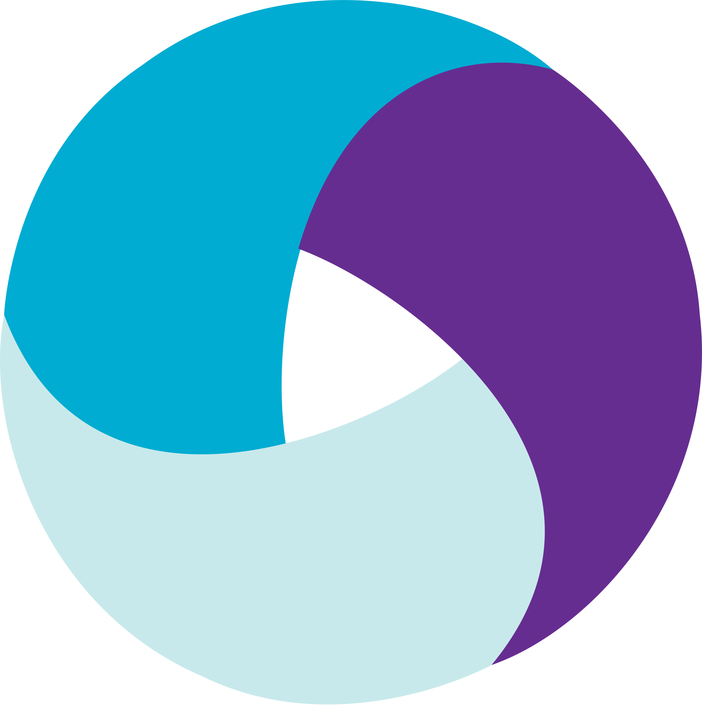
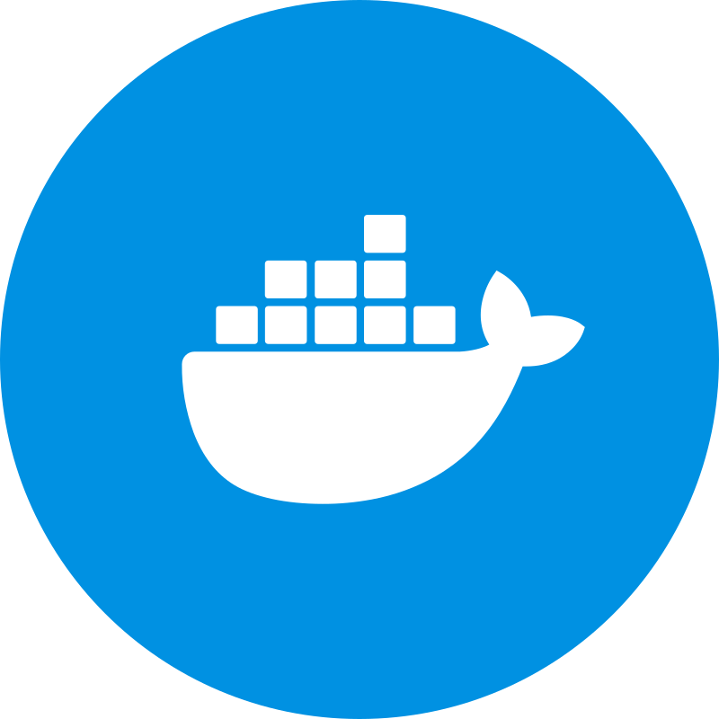
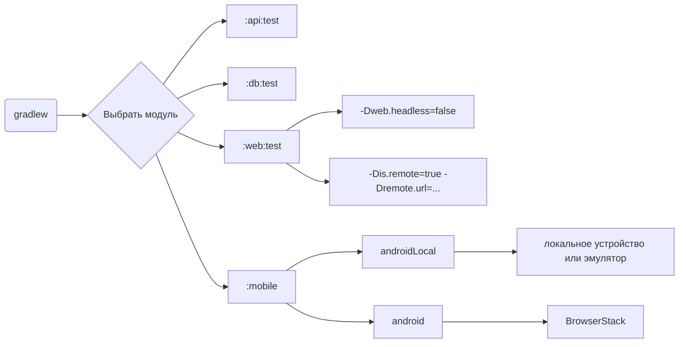
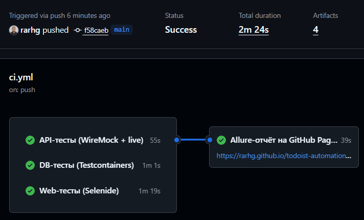
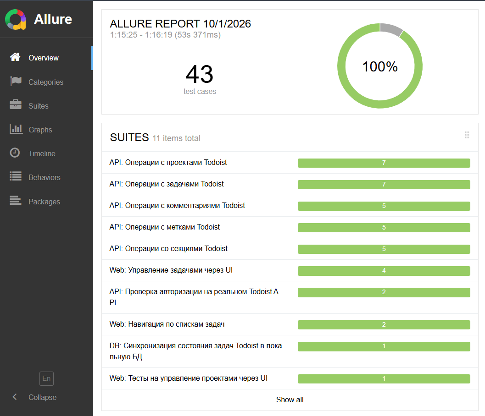
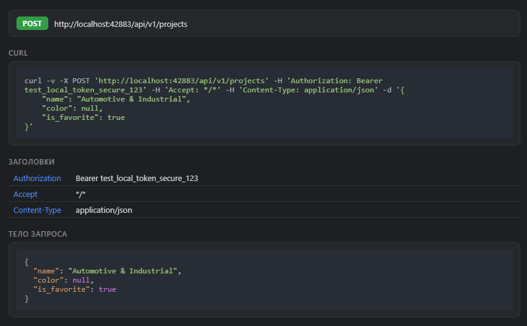
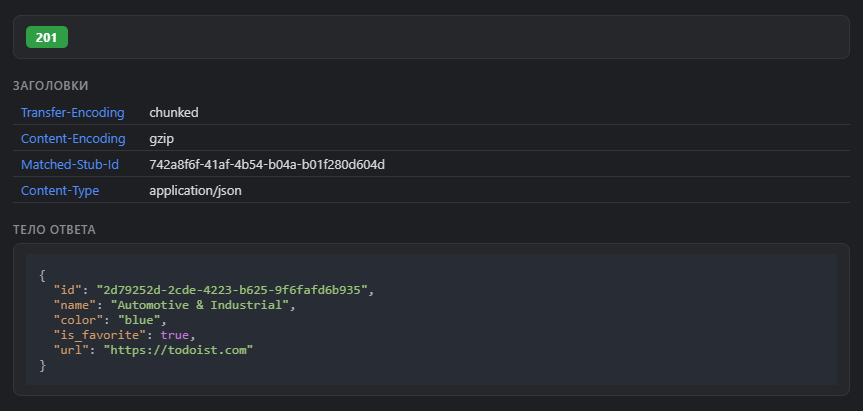
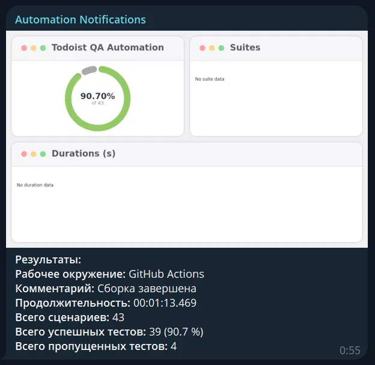
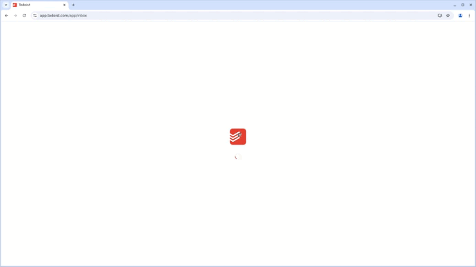
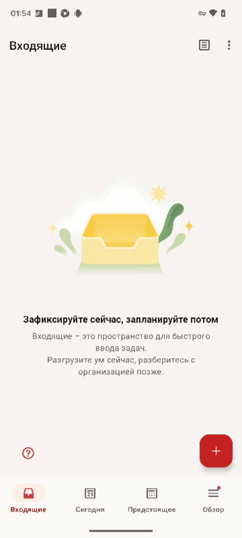

<h1>Проект автоматизации тестирования <a target="_blank" href="https://todoist.com/"> Todoist </a> </h1>

<p align="center">

</p>

<p align="center">
<a href="https://github.com/rarhg/todoist-automation-framework/actions/workflows/ci.yml"></a>
<a href="https://rarhg.github.io/todoist-automation-framework/"></a>
</p>

## Содержание
+ [Описание](#Описание)
+ [Технологии и инструменты](#Технологии-и-инструменты)
+ [Реализованные проверки](#Реализованные-проверки)
+ [Структура проекта](#Структура-проекта)
+ [Запуск тестов](#Запуск-тестов)
    + [Допустимые комбинации](#Допустимые-комбинации)
    + [Локальный запуск тестов](#Локальный-запуск-тестов)
    + [Удаленный запуск тестов](#Удаленный-запуск-тестов)
+ [Сборка тестов в GitHub Actions](#Сборка-тестов-в-GitHub-Actions)
+ [Интеграция с Allure Report](#интеграция-с-allure-report)
+ [Уведомления в Telegram с использованием бота](#Уведомления-в-Telegram-с-использованием-бота)
+ [Примеры выполнения тестов](#Примеры-выполнения-тестов)
+ [Безопасность и секреты](#Безопасность-и-секреты)

## Описание
Todoist — менеджер задач и проектов с веб-версией, REST API и мобильными приложениями.
Проект состоит из API, UI (Web), мобильных (Android) и DB-тестов в одном Gradle-монорепозитории. <br/>

**Особенности проекта**:
- `Page Object` / `Screen Object` шаблон проектирования и слой `Steps` для API
- Использование технологии `Owner` для гибкой конфигурации (`common.properties` → `local.properties` → `-D`)
- Возможность запуска тестов: локально, удалённо (Selenoid), в облаке (BrowserStack), по модулям и тегам
- Мокирование API через `WireMock`, проверка контракта ответа по `JSON Schema`
- Использование `Faker` для генерации данных
- Использование `Lombok` для моделей в API тестах
- Использование собственных компонентов:
    - `CookieAuthManager` для входа в web по сохранённой сессии (в обход капчи)
    - `RetryOnServerErrorFilter` для повторов при сбоях 502/503/504 и сетевых ошибках
    - `AppiumExtension` и `MobileTestWatcher` для управления драйвером и диагностики падений
- Данные для тестов готовятся и удаляются через реальный API Todoist
- CI в GitHub Actions, отчёт публикуется на GitHub Pages
- Уведомление о результатах прохождения в Telegram
- По итогу прохождения автотестов генерируется Allure отчет. Содержание отчета:
    - Шаги теста
    - Скриншот страницы на последнем шаге
    - Исходный код страницы (web, mobile)
    - Логи консоли браузера
    - HTTP-запросы и ответы с подсветкой JSON и готовым cURL
    - Видео выполнения автотеста (при запуске в Selenoid)

## Технологии и инструменты

<div align="center">
<a href="https://www.jetbrains.com/idea/"></a>
<a href="https://github.com/"></a>
<a href="https://www.java.com/"></a>
<a href="https://gradle.org/"></a>
<a href="https://junit.org/junit5/"></a>
<a href="https://selenide.org/"></a>
<a href="https://aerokube.com/selenoid/"></a>
<a href="https://rest-assured.io/"></a>
<a href="https://wiremock.org/"></a>
<a href="https://www.browserstack.com/"></a>
<a href="https://appium.io/"></a>
<a href="https://www.docker.com/"></a>
<a href="https://testcontainers.com/"></a>
<a href="https://www.postgresql.org/"></a>
<a href="https://github.com/allure-framework/"></a>
<a href="https://telegram.org/"></a>
</div>

| Назначение | Технологии |
|------------|------------|
| Язык и сборка | Java 17, Gradle |
| Тестовый фреймворк | JUnit 5 (5.10.2), AssertJ (3.25.3), Datafaker (2.2.2), Lombok |
| API | REST Assured 5.4.0, WireMock 3.5.4 |
| Web | Selenide 7.3.0 (Selenium 4.22.0), Selenoid |
| Mobile | Appium java-client 9.2.2, UiAutomator2, BrowserStack |
| База данных | Testcontainers 1.21.4, PostgreSQL 16 |
| Отчётность | Allure 2.27.0 |
| Конфигурация | OWNER |
| CI/CD | GitHub Actions, GitHub Pages, Telegram |

## Реализованные проверки

**Итого: 54 активных автотеста (+4 отключённых), 34 ручных тест-кейса, 2 оформленных баг-репорта.**

### Api (WireMock) — 29 тестов
- [x] Создание, получение, обновление и удаление проекта
- [x] Создание, получение, обновление, закрытие и удаление задачи
- [x] Проверка контракта ответа задачи по JSON-схеме
- [x] Создание, получение (один / список), обновление и удаление метки
- [x] Создание, получение (один / список), обновление и удаление комментария
- [x] Создание, обновление и удаление раздела
- [x] Запрос без токена и с невалидным токеном (401)
- [x] Пустое имя проекта, раздел без имени, невалидный `project_id` (400)
- [x] Получение задачи и раздела по несуществующему ID (404)

### Api (реальный API, тег `live`) — 2 теста
- [x] Создание проекта без авторизационного токена (401/403)
- [x] Создание проекта с невалидным токеном (401/403)

### Web — 7 тестов (+4 `@Disabled`)
- [x] Создание задачи через UI и проверка её появления во Входящих
- [x] Выполнение задачи кликом по чекбоксу
- [x] Удаление задачи через контекстное меню с подтверждением
- [x] Изменение названия задачи через панель деталей
- [x] Создание проекта через UI
- [x] Навигация между списками «Входящие» / «Сегодня» (@ParameterizedTest)
- [ ] Сценарии входа (`LoginTest`) — отключены из-за капчи, проверяются вручную

### Mobile (Android) — 15 тестов
- [x] Успешный вход в приложение по Email
- [x] Неуспешная регистрация: невалидный Email, короткий пароль, пустые поля
- [x] Выход из аккаунта
- [x] Создание простой задачи через UI
- [x] «Умное» распознавание даты (NLP) при вводе задачи (@ParameterizedTest, 5 кейсов)
- [x] Отметка задачи выполненной по динамическому локатору
- [x] Выбор даты в календаре-ленте «Предстоящие»
- [x] Переключение раскладки Список ↔ Доска и горизонтальный свайп между колонками

### DB (Testcontainers) — 1 тест
- [x] Закрытие задачи в Todoist отражается статусом `COMPLETED` в локальной PostgreSQL

### Ручные проверки

| Артефакт | Web | Mobile (Android) |
|----------|-----|------------------|
| Чек-лист | [checklist-web.md](manual/web/checklist-web.md) | [checklist-mob.md](manual/mobile/checklist-mob.md) |
| Тест-кейсы | [test-cases-web.md](manual/web/test-cases-web.md) — 10 кейсов | [test-cases-mob.md](manual/mobile/test-cases-mob.md) — 24 кейса |

- **Web:** вход и выход, поиск, фильтры, редактирование задачи, drag-n-drop, undo, разделы, метки, комментарии, массовые действия
- **Mobile:** push-уведомления, голосовой ввод Ramble, офлайн-режим, Process Death, смена сети и часового пояса, масштаб шрифтов, share-меню, поиск, негативные сценарии ввода

Окружение прогона: Web — Chrome 153; Mobile — Android 16, POCO C85.

### Найденные дефекты

| ID | Название | Severity | Priority | Статус |
|----|----------|----------|----------|--------|
| [BUG-01](manual/bug-reports/BUG-001.md) | Голосовой ввод: повторное упоминание текста задачи перезаписывает её вместо создания новой | Major | High | Open |
| [BUG-02](manual/bug-reports/BUG-002.md) | Индикатор записи голоса не отражает фактическую паузу при входящем звонке | Minor | Low | Open |

## Структура проекта

```
todoist-qa-automation
├── .github/workflows/ci.yml — CI: api, db, web + публикация отчёта
├── common   — конфигурация: ProjectConfig, ConfigProvider, config/*.properties
├── api      — модели, Specs, Steps, WireMock-стабы, Allure-шаблоны и API-тесты
├── web      — Selenide: pages, components, helpers (сессия), тесты
├── mobile   — Appium: screens, helpers, тесты
├── db       — Testcontainers + PostgreSQL: DAO, сервис синхронизации, тест
├── config/allure — categories.json и environment.properties для отчёта
├── selenoid — docker-compose и browsers.json для удалённого запуска web
├── manual   — чек-листы, тест-кейсы, баг-репорты
└── docs/media — логотипы, скриншоты и гифки
```

Зависимости модулей: `api → common`; `web`, `mobile`, `db → common + api`.

## Запуск тестов
> [!NOTE]
> Убедитесь, что установлены JDK 17, Docker (для `db` и Selenoid) и Chrome (для `web`)

> [!IMPORTANT]
> Перед запуском создайте `common/src/main/resources/config/local.properties` по шаблону `local.properties.example` и пропишите данные **отдельного тестового аккаунта** Todoist: `api.token`, `test.email`, `test.password`. Mobile-тесты после каждого теста удаляют все активные задачи аккаунта.

Настройки читаются от низшего приоритета к высшему: `common.properties` (в git) → `local.properties` (вне git) → параметры `-D`.

### Допустимые комбинации



### Локальный запуск тестов

#### API
```
./gradlew :api:test
```

#### DB
```
./gradlew :db:test
```
Нужны запущенный Docker и `api.token`.

#### WEB
```
./gradlew :web:test
```
Нужна сохранённая сессия: форма входа защищена капчей, поэтому вход выполняется вручную один раз.

1. Запустите Chrome с отладочным портом:
   ```
    Start-Process "chrome.exe" -ArgumentList "--remote-debugging-port=9222", "--user-data-dir='C:\chrome-todoist-profile'"
   ```
2. В этом окне войдите на app.todoist.com вручную
3. Выполните `./gradlew :web:saveSession` — сессия сохранится в `web/auth-state.json` (живёт около двух недель)

#### Mobile
```
./gradlew :mobile:androidLocal
./gradlew :mobile:android
```
- [ ] <code>androidLocal</code> : локальное устройство или эмулятор (Appium, Android SDK, `local.device.name`)
- [ ] <code>android</code> : облачная платформа <a target="_blank" href="https://www.browserstack.com/"> BrowserStack </a> (ключи `bs.*`)

<details>
   <summary>Дополнительные команды:</summary>

1. Открыть Allure-отчёт в браузере:
```
./gradlew allureServe
```
2. Пересобрать результаты после правки Allure-шаблонов:
```
./gradlew :api:clean :api:test
```

</details>

### Удаленный запуск тестов
Web-тесты можно выполнить в браузере, запущенном в Docker-контейнере Selenoid:

1. Создайте `selenoid/.env` по шаблону `selenoid/.env.example`
2. Скачайте образы: `docker pull selenoid/vnc_chrome:128.0` и `docker pull selenoid/video-recorder:latest-release`
3. Из папки `selenoid` выполните `docker compose up -d`
4. Запустите тесты из корня проекта (UI Selenoid: `http://localhost:8080`):
```
./gradlew :web:test "-Dis.remote=true" "-Dremote.url=http://localhost:4444/wd/hub" "-Dweb.headless=false"
```

Параметры, которыми можно управлять:
```
-Dbrowser - наименование браузера. По умолчанию CHROME
-Dbrowser.version - номер версии браузера
-Dbrowser.size - размер окна браузера. По умолчанию 1920x1080
-Dweb.headless - режим без окна. По умолчанию true
-Dis.remote - запуск в удалённом браузере
-Dremote.url - адрес удалённого сервера
```

> [!TIP]
> В Windows PowerShell каждый аргумент `-D...` берите в кавычки.

## Сборка тестов в <b><a target="_blank" href="https://github.com/rarhg/todoist-automation-framework/actions/workflows/ci.yml">GitHub Actions</a></b>

>Пайплайн запускается при push и pull request в `main`, а также вручную через `Run workflow`



| Джоба | Что делает |
|-------|------------|
| `api` | `:api:test` — WireMock + live-проверка авторизации |
| `db` | `:db:test` — Testcontainers |
| `web` | `:web:test` — Selenide, сессия из секрета `AUTH_STATE_JSON` |
| `report` | Собирает результаты, публикует Allure-отчёт на GitHub Pages и отправляет уведомление в Telegram |

**Секреты репозитория:** `API_TOKEN`, `AUTH_STATE_JSON`, `TELEGRAM_BOT_TOKEN`, `TELEGRAM_CHAT_ID`. В Settings → Pages источник — **GitHub Actions**.

Mobile в CI не запускается: нужны устройство или эмулятор и Appium.

## Интеграция с <b><a target="_blank" href="https://rarhg.github.io/todoist-automation-framework/">Allure report</a></b>

`OVERVIEW` — общее количество тестов и диаграмма успешных, упавших и сломавшихся <br/>
`CATEGORIES` — распределение неудачных тестов по типам дефектов (дефекты продукта, проблемы окружения, хрупкость локаторов, инфраструктура, пропущенные) <br/>
`SUITES` — распределение тестов по Epic / Feature / Story



#### HTTP-вложения
Каждый запрос и ответ REST Assured попадает в отчёт через собственные шаблоны `todoist-http-request.ftl` и `todoist-http-response.ftl`: цветной бейдж метода и статус-кода, таблицы заголовков, подсветка JSON, готовый cURL.




## Уведомления в Telegram с использованием бота

> Бот после завершения сборки отправляет сообщение с результатами прогона

<p align="center">

</p>

В уведомлении 43 сценария, а не 54: mobile-тесты (15) в CI не запускаются, а 4 пропущенных — отключённые тесты `LoginTest`.

## Примеры выполнения тестов

> Web-тест в Selenoid (создание задачи)
<p align="center">
  
</p>

> Mobile-тест в BrowserStack (раскладка Список / Доска)
<p align="center">
  
</p>

## Безопасность и секреты

- Токены, логин и пароль, ключи BrowserStack и файл сессии хранятся вне git: `local.properties` и `web/auth-state.json` в `.gitignore`. В репозитории лежат только шаблоны `local.properties.example` и `selenoid/.env.example`
- В CI секреты передаются через GitHub Secrets, токен API маскируется в результатах Allure перед публикацией
- Запросы к API логируются в консоль Gradle полностью, включая заголовок `Authorization`: не публикуйте скриншоты консоли
- Если секрет утёк: перевыпустите токен Todoist, смените пароль, пересоздайте ключ BrowserStack, обновите секреты в GitHub и вычистите файл из истории git